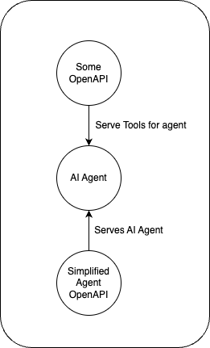
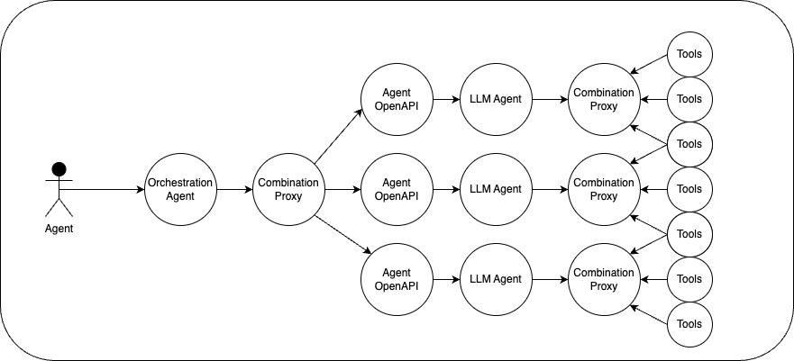
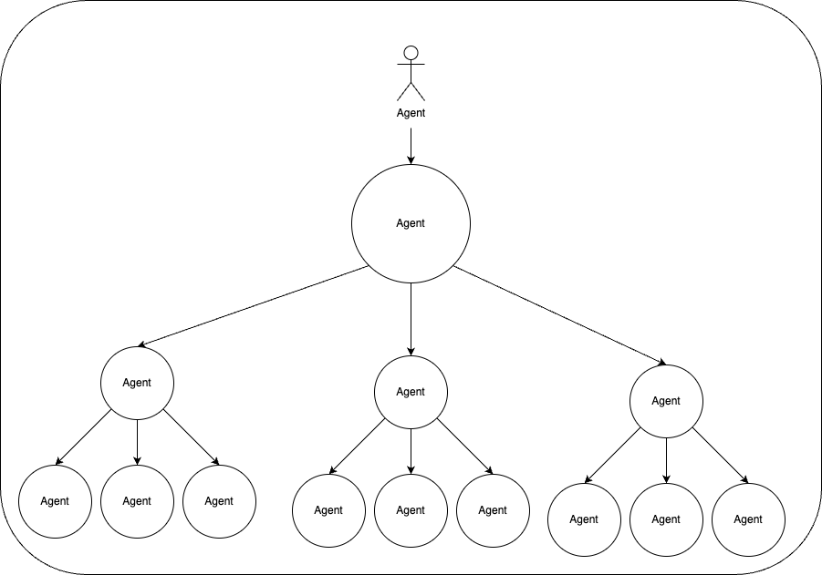

# OpenAPI Chat Completion

Turns every OpenAPI into a /chat/completions endpoint, that in itself is exposed as OpenAPI as well.

This is the successor of [Agent-Openapi](https://github.com/CodeFromAnywhere/agent-openapi). The biggest difference is it's fully stateless!!

## Getting started

See https://chat.actionschema.com

## Why?

LLM Assistants can be incredibly powerful as a single tool, but there's no easy way to turn an agent into a tool for another agent.

The Agent OpenAPI serves an OpenAPI for talking to an agent, so it can be discovered publicly, and can be used as a tool for other agents.

## Orchestration Agent

With the above tooling, we can now create an agent that orchestrates certain taks to downstream agents. Taking response time limitations out of the equation, this "agent stacking" pattern can be done in a deeply nested way.

## Goals

- Easy maintenance of your agents
- API access to your agents
- Provide an openapi, and details for each agent
- Provide message api that executes the tools
- High degree of modularity
- Remove need for adding an agent; as long as you provide the openapi, the agent should be made available with some default instructions.

## Non-goals

- Testing agents
- Support for propriatary features like openai code-interpreter or file-search

# TODO:

# Finalise

- ✅ Debug tools and make them functional
- Show indicators and little card when tool(s) are called and when they return, stop loading

# Auth

Obviously i want to immediately login when navigating to another openapi. How exactly this should be done IDK yet but most likely links to login in redirect with custom redirecturls

# Dynamic OpenAPI

🔥 Threads get stored independently of openapiUrl, only in localStorage. OpenapiUrl can be re-routed without trouble, making it dynamic while keeping thread as-is.

The url determines the openapi, the openapi determines the tools and authorization. I have already added operationIds, but another very interesting thing would be to embed actionschema search into big openapis, so we only show the most relevant tool(s) based on the messages.

# Better

- Aggregate to JSON (`streamToJsonResponse`)
- Add user ratelimit of 60 messages per hour
- Allow edge

# Decisions/questions

- Can i make this embeddable using a little circle turning into a sidebar? That would be a very nice add-on
- Do access token check on frontend as well as on backend? Can be useful UX wise.
- Shall I allow for additional tools (that aren't executed, but live alongside it)? For now, respond with 'tools need to be supplied over OpenAPI'.
- Allowed additional header for LLM basePath + secret
- How do I make sure this thing keeps being a top priority? This seems like a great great value-add
